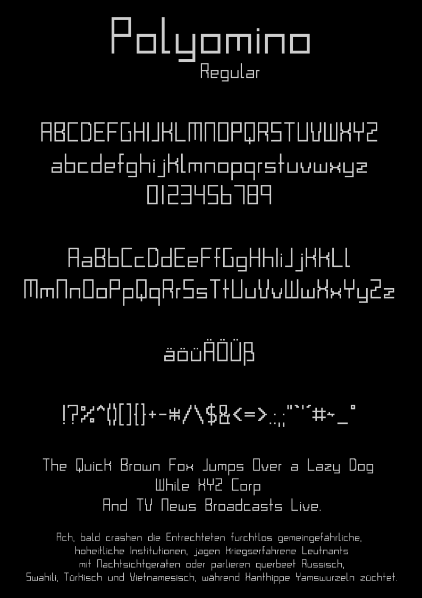
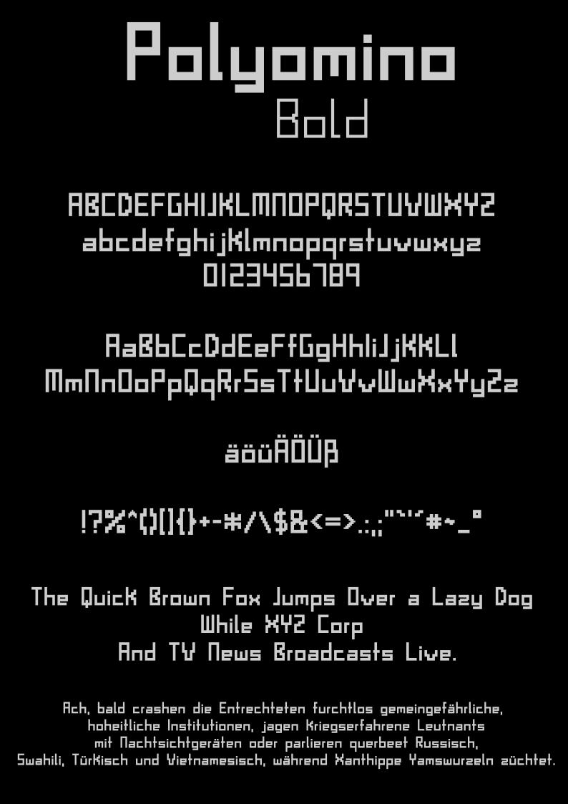

# Polyomino-Font
A simple, geometric font whose characters consist entirely* of polyominoes.

# What are polyominoes?
> A polyomino is a plane geometric figure, connected, formed by joining a finite number
> of unit squares edge-to-edge. It is a polyform whose cells are squares.

Source and more Info: [Polyomino](https://en.wikipedia.org/wiki/Polyomino).

# Exceptions*
Some glyphs of the bold variant are composed of squares that are 25% the size
of the squares used in other bold characters to form polyominoes.
Sometimes, it seems geometrically impossible to remain within the grid 
while simultaneously using 100%-sized bold squares, or it simply does 
not look harmonic.

# Glyphs
- Basic Latin
- Some glyphs of Latin-1 Supplement (äüöÄÜÖß°´)

# Weights
- Regular
- Bold 
 
# Preview
## Regular

## Bold

