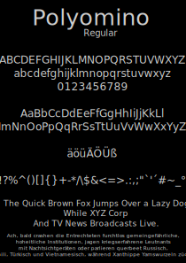

# Polyomino-Font
A simple, geometric font whose characters consist entirely of polyominoes.

# What are polyominoes?
See [Polyomino](https://en.wikipedia.org/wiki/Polyomino).

# Glyphs
- Basic Latin
- Some glyphs of Latin-1 Supplement (äüöÄÜÖß°´)

# Weights
- Regular
 
# Preview
